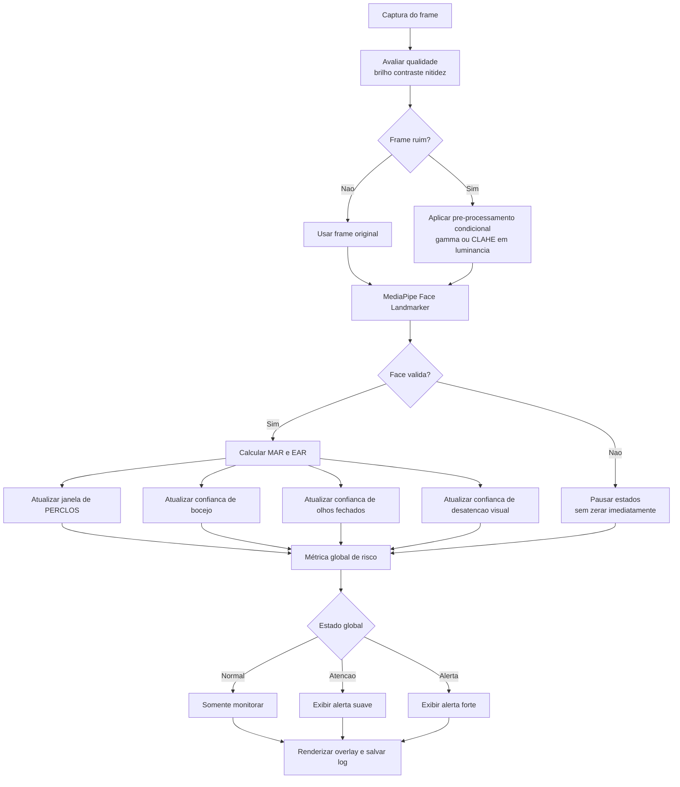

# TODO - Pipeline robusto para sonolência e desatenção

## Objetivo

Construir um pipeline único, usando `main.py` como base, para detectar sonolência e desatenção a partir de características faciais com MediaPipe e OpenCV.

O sistema deve:

- extrair 3 métricas principais: `PERCLOS`, `MAR` e posição do olhar;
- agregar as confianças temporais das 3 métricas em um risco global;
- tratar oclusões faciais sem zerar estados imediatamente;
- processar frames com qualidade e pré-processamento condicional;
- evitar falsos positivos e oscilações rápidas;
- confirmar eventos em janelas temporais adequadas.

---

## Diagrama do fluxo

---

## Diretriz principal de implementação

Não usar um threshold simples em cada frame como decisão final.

Em vez disso, cada métrica deve gerar uma `confiança temporal` entre `0.0` e `1.0`:
- Sobe quando a evidência persiste
- Cai gradualmente quando a evidência desaparece

Depois disso, um agregador global combina as confiança em um estado final de risco.

Essa abordagem é melhor que:
- disparar alerta diretamente por valor instantâneo;
- fazer uma média ponderada dos valores crus antes de estabilizar cada fenômeno.

Nao usar um threshold simples em cada frame como decisao final.

Em vez disso, cada metrica deve gerar uma `confianca temporal` entre `0.0` e `1.0`.
Essa confianca sobe quando a evidencia persiste e cai gradualmente quando a evidencia desaparece.

Depois disso, um agregador global combina as confiancas em um estado final de risco.

Essa abordagem e melhor que:

- disparar alerta diretamente por valor instantaneo;
- fazer uma media ponderada dos valores crus antes de estabilizar cada fenomeno.

---

## Sprint 1 - Implementação de PERCLOS

✅ **CONCLUÍDO** - Implementação do processo de captura de PERCLOS (Percentage of Eyelid Closure) baseado em EAR.

### Tarefa 1.1: Capturar estado do olho por frame

- [x] Usar a métrica `EAR` (Eye Aspect Ratio) para determinar se olho está aberto ou fechado
  - Implementado em `eye_detector.py`: função `get_eye_aspect_ratio()`
  - Calcula EAR para olho direito, esquerdo e média
  
- [x] Definir threshold claro para classificação (ex: `EAR_CLOSED_THRESHOLD = 0.2`)
  - Implementado em `EyeStateTracker`: `closed_ratio = 0.72` (percentual do EAR aberto)
  - `close_threshold = open_ear * 0.72`
  - `open_threshold = close_threshold + 0.03` (histerese para evitar oscilação)
  
- [x] Gerar estado binário: `EYE_OPEN` ou `EYE_CLOSED` por frame
  - Estados: "CALIBRATING", "EYE_OPEN", "EYE_CLOSED"
  - Retorna estado_numeric: 1 (aberto) ou 0 (fechado)
  
- [x] Aplicar suavização leve para reduzir jitter
  - Implementado: `smoothing_window = 5` frames
  - Media móvel dos últimos 5 valores de EAR

### Tarefa 1.2: Calcular porcentagem na janela

- [x] Manter janela deslizante de tempo (ex: 20 segundos)
  - Implementado em `PerclosTracker`: `window_seconds = 20`
  
- [x] Contabilizar frames com olho fechado vs. aberto
  - Cada frame armazenado com timestamp e estado (closed: 0 ou 1)
  - Deque automático remove frames antigos (> 20 segundos)
  
- [x] Calcular: `PERCLOS = (frames_fechados / total_frames) * 100%`
  - Fórmula exata implementada: `perclos = (closed_frames / total_frames) * 100`
  
- [x] Atualizar valor a cada novo frame
  - Método `update()` chamado a cada frame em `main.py`

### Tarefa 1.3: Calcular confiança do PERCLOS

- [x] Gerar score de confiança `[0.0 - 1.0]` baseado em:
  - Classe `TemporalConfidence` implementada
  - `increase_rate = 0.08` (sobe quando evidência persiste)
  - `decrease_rate = 0.04` (cai gradualmente quando evidência some)
  - Intervalo: `[0.0 - 1.0]`
  - Tempo de preenchimento da janela: controla início dos alertas (primeiros frames não geram confiança alta)
  - consistência do sinal de fechamento
  - qualidade da detecção da face
- [ ] Elevar confiança quando PERCLOS persiste alto
- [ ] Diminuir confiança gradualmente quando PERCLOS baixa

---

## Sprint 2 - Implementação de MAR

🔶 **EM ANDAMENTO** - Implementação de MAR (Mouth Aspect Ratio) para detectar boca aberta e bocejos.

### Tarefa 2.1: Capturar estado da boca por frame

- [x] Usar a métrica `MAR` para medir abertura da boca
  - Implementado em `mouth_detector.py`: função `get_mouth_data()`
  - Calcula: `MAR = (vertical_left + vertical_center + vertical_right) / (2 * horizontal)`
  
- [ ] Definir threshold para boca aberta simples (ex: `MAR_OPEN_THRESHOLD = 0.5`)
- [ ] Definir threshold para bocejo (ex: `MAR_YAWN_THRESHOLD = 0.9`)
- [ ] Gerar estado: `MOUTH_CLOSED`, `MOUTH_OPEN`, `YAWN_LIKE`
- [ ] Aplicar suavização para reduzir efeitos de fala rápida

### Tarefa 2.2: Diferenciar fala de bocejo

- [ ] Reconhecer que fala abre bastante a boca por poucos frames
- [ ] Bocejo requer: amplitude alta + persistência + curva lenta de abertura/fechamento
- [ ] Medir duração do evento (bocejo típico: `0.5 - 1.5 s`)
- [ ] Aplicar cooldown após detectar bocejo

### Tarefa 2.3: Calcular confiança de MAR

- [ ] Gerar score de confiança `[0.0 - 1.0]` baseado em:
  - amplitude do sinal (quão aberta está a boca)
  - duração da abertura
  - frequência de ocorrência
- [ ] Elevar confiança rapidamente para abertura sustentada
- [ ] Diminuir confiança ao detectar fala vs bocejo

---

## Sprint 3 - Implementação de Posição do Olhar

✅ **CONCLUÍDO** - Implementação do tracking da posição do olhar (gaze) para detectar desatenção visual.

### Tarefa 3.1: Extrair posição da íris

- [x] Localizar o centro da íris dentro do frame
  - Implementado em `eye_detector.py`: função `get_gaze_direction()`
  - Usa landmarks: 468 (íris direita), 473 (íris esquerda)
  
- [x] Calcular desvio horizontal e vertical em relação à posição neutra
  - Usa landmarks dos cantos internos (33, 362) e externos (133, 263)
  - Calcula ratio: `gaze_ratio = (right_ratio + left_ratio) / 2`
  
- [ ] Definir faixa neutra central (ex: `±15 graus`)
- [ ] Aplicar suavização para evitar jitter

### Tarefa 3.2: Classificar direção do olhar

- [x] Estados básicos implementados:
  - `gaze_ratio < 0.4`: "Olhando ESQUERDA"
  - `gaze_ratio > 0.6`: "Olhando DIREITA"  
  - Caso contrário: "Olhando FRENTE"
  
- [ ] Implementar estados mais granulares: `DOWN`, `UP`
- [ ] Reconhecer movimento rápido vs. fixação prolongada
- [ ] Aplicar debounce para evitar oscilações rápidas

### Tarefa 3.3: Calcular confiança de desatenção visual

- [ ] Gerar score de confiança `[0.0 - 1.0]` baseado em:
  - desvio da posição neutra (quanto mais longe, mais alerta)
  - duração da fixação lateral (deve persistir para ser desatenção)
  - qualidade da detecção da íris
- [ ] Elevar confiança quando olhar fica longe por tempo sustentado
- [ ] Diminuir confiança ao retornar à zona neutra
- [ ] Não alertar por movimentos breves de verificação

---

## Sprint 4 - Agregar Confianças identificadas

Combinar as 3 confiançastemporais (PERCLOS, MAR, Gaze) em um escore global de risco.

### Tarefa 4.1: Estrutura de estado

- [ ] Criar variáveis para armazenar:
  - `confidence_perclos`: [0.0 - 1.0]
  - `confidence_mar`: [0.0 - 1.0]
  - `confidence_gaze`: [0.0 - 1.0]
  - `global_risk`: [0.0 - 1.0]
  - `global_state`: `NORMAL`, `ATENCAO`, `ALERTA`

### Tarefa 4.2: Definir pesos para agregação

- [ ] Estabelecer pesos iniciais:
  - PERCLOS: `0.50` (sinal mais importante de sonolência)
  - MAR: `0.30` (bocejo/fadiga)
  - Gaze: `0.20` (desatenção complementar)
- [ ] Calcular: `global_risk = 0.50*conf_perclos + 0.30*conf_mar + 0.20*conf_gaze`

### Tarefa 4.3: Implementar histerese de estados

- [ ] Estados e transições:
  - `NORMAL`: `global_risk < 0.25`
  - `ATENCAO`: `0.25 <= global_risk < 0.65`
  - `ALERTA`: `global_risk >= 0.65`
- [ ] Saída de `ATENCAO` apenas quando `global_risk < 0.15`
- [ ] Saída de `ALERTA` apenas quando `global_risk < 0.45`
- [ ] Evitar oscilações rápidas de estado

---

## Sprint 5 - Tratar Oclusões de Cada Métrica

Implementar degradação graceful quando a face é perdida ou ocluída parcialmente.

### Tarefa 5.1: Detectar oclusão de face

- [ ] Criar contador de frames sem detecção válida de face
- [ ] Tolerar ausência curta: `0.5 - 1.0 s` (típico: 15-30 frames @ 30 fps)
- [ ] Diferenciar: perda momentânea vs. perda persistente

### Tarefa 5.2: Degradação de confiançass durante oclusão

- [ ] Durante perda momentânea:
  - Não zerar as confiançass imediatamente
  - Congelar os valores atuais
  - Começar a decrementar lentamente (ex: `-0.01` por frame)
- [ ] Durante perda persistente (> 1.0 s):
  - Sinalizar que face está ausente
  - Parar de atualizar métricas
  - Manter estado mas marcar como "congelado"

### Tarefa 5.3: Recuperação após retorno da face

- [ ] Quando face retorna:
  - Retomar atualização normal das confiançass
  - Permitir aumento natural das confiançass
  - Não ressaltar o estado anterior (evitar alerta falso)
- [ ] Log de eventos: entrada/saída de oclusão

### Tarefa 5.4: Suavização ao perder rosto

- [ ] Aplicar degradação suave:
  - Não cortar abruptamente a confiança
  - Usar decremento linear ou exponencial
  - Preservar histórico de PERCLOS (janela deslizante)

---

## Sprint 6 - Tratamento de Qualidade e Pré-processamento de Frames

Implementar avaliação de qualidade e pré-processamento condicional do frame.

### Tarefa 6.1: Avaliar qualidade do frame

- [ ] Medir propriedades do frame:
  - `mean_luma`: média da luminância
  - `dynamic_range`: faixa de contraste (p90 - p10)
  - `laplacian_variance`: nitidez aproximada (detecta blur)
  - `contrast_ratio`: relação de contraste local

### Tarefa 6.2: Classificar qualidade

- [ ] Estados: `GOOD`, `DEGRADED`, `POOR`
- [ ] Regras:
  - `GOOD`: brilho >50, dynamic_range > 50, laplacian_var > 100
  - `DEGRADED`: falha em 1-2 critérios
  - `POOR`: falha em 3+ critérios
- [ ] Usar qualidade para ajustar confiança nas métricas

### Tarefa 6.3: Aplicar pré-processamento condicional

- [ ] Quando `DEGRADED` ou `POOR`:
  - Tentar correção gama (clarear se muito escuro)
  - Testar CLAHE na luminância para contraste local
  - Evitar filtros que distorçam a geometria facial
- [ ] Quando `GOOD`: usar frame original

### Tarefa 6.4: Logging e histórico de qualidade

- [ ] Registrar qualidade por frame
- [ ] Correlacionar qualidade com confiança das métricas
- [ ] Identificar cenários problemáticos para calibração

---

## Parâmetros iniciais sugeridos

Esses valores não são definitivos. São um ponto de partida para teste.

### Thresholds de EAR (PERCLOS)

- `EAR_CLOSED_THRESHOLD = 0.2`: olho está fechado
- PERCLOS janela: `20 segundos`
- Mínimo preenchimento: `10 segundos` antes de alertar

### Thresholds de MAR (Boca)

- `MAR_OPEN_THRESHOLD = 0.5`: boca aberta simples
- `MAR_YAWN_THRESHOLD = 0.9`: suspeita de bocejo
- `MIN_YAWN_DURATION = 0.5 s`: bocejo requer persistência
- Cooldown de bocejo: `2-3 s` antes de permitir novo bocejo

### Thresholds de Gaze (Olhar)

- `GAZE_NEUTRAL_ZONE = 15 graus`: faixa de olhar normal
- `GAZE_ALERT_THRESHOLD = 25 graus`: desvio considerável
- `MIN_GAZE_DURATION = 3 s`: olhar deve persistir para desatenção

### Qualidade de Frame

- `MIN_LUMA = 50`: brilho mínimo aceitável
- `MIN_DYNAMIC_RANGE = 50`: contraste mínimo
- `MIN_LAPLACIAN_VAR = 100`: nitidez mínima

### Agregação e Estados

- `NORMAL`: global_risk < 0.25
- `ATENCAO`: 0.25 <= global_risk < 0.65
- `ALERTA`: global_risk >= 0.65
- Histerese de saída: -0.10 ponto para cada estado

---

## Ordem imprescindível de trabalho

1. **Sprint 1**: PERCLOS (foundation de detecção de sonolência)
2. **Sprint 2**: MAR (detecção complementar)
3. **Sprint 3**: Gaze (desatenção visual)
4. **Sprint 4**: Agregação (combinar os 3 sinais)
5. **Sprint 5**: Oclusões (robustez contra perda de face)
6. **Sprint 6**: Frames (qualidade e pré-processamento)

---

## Erros que valem evitar

- Usar média ponderada dos valores crus sem estabilizar cada métrica
- Zerar todo o estado ao perder a face por poucos frames
- Aplicar filtros em todos os frames sem necessidade
- Usar gaze como alerta forte logo na primeira versão
- Calibrar thresholds só no olho, sem log e sem cenários repetíveis
- Alertar cedo demais antes da janela estar preenchida
- Não diferenciar fala de bocejo
- Não tratar oscilações rápidas durante perda momentânea de face

---

## Resultado final esperado

Ao final, o programa deve:

- Detectar sonolência com foco em persistência, não em valores instantâneos
- Reduzir oscilações de alerta
- Reduzir falsos positivos de fala, piscada e movimentos curtos do olhar
- Lidar melhor com baixa iluminação
- Mostrar ao usuário por que o sistema decidiu alertar
- Manter histórico robusto mesmo durante perda momentânea de face
- Agregar 3 sinais independentes de forma interpretável

---